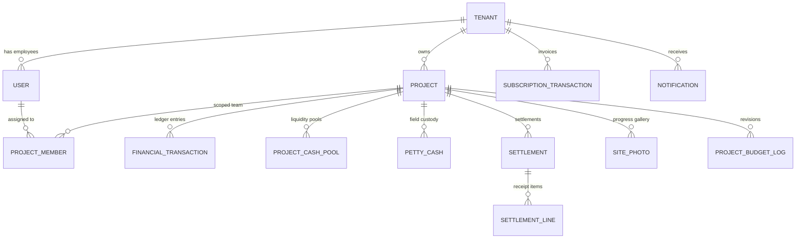

# 🛡️ تقرير التدقيق الشامل والنهائي قبل الإطلاق الحي للمنصة (Final Pre-Launch Audit Report)

**تاريخ وساعة التدقيق:** 26 أغسطس 2026  
**الإصدار المستهدف:** Structo ERP v1.0.0 (Production Live)  
**نطاق التدقيق:** تدقيق فاحص وشامل لكل سطر كود، متحكم (Controller)، مسار واجهة (Frontend Route)، علاقة قاعدة بيانات (EF Core Entity)، مفاتيح التشفير، وإعدادات بوابات الدفع في بيئة الإنتاج على Railway.

---

## 📑 فهرس التقرير

1. [مخزون ومخطط النظام الكامل (Complete Feature Inventory)](#1-مخزون-ومخطط-النظام-الكامل-complete-feature-inventory)
   - [أولاً: حصر كافة متحكمات ونقاط نهاية الـ Backend](#أولا-حصر-كافة-متحكمات-ونقاط-نهاية-الـ-backend)
   - [ثانياً: حصر كافة مسارات وشاشات الـ Frontend](#ثانيا-حصر-كافة-مسارات-وشاشات-الـ-frontend)
   - [ثالثاً: مخطط الكيانات والعلاقات الأساسية](#ثالثا-مخطط-الكيانات-والعلاقات-الأساسية)
   - [رابعاً: الخدمات المجدولة في الخلفية (Background Workers)](#رابعا-الخدمات-المجدولة-في-الخلفية-background-workers)
   - [خامساً: التكاملات الخارجية وحالتها التشغيلية](#خامسا-التكاملات-الخارجية-وحالتها-التشغيلية)
   - [سادساً: الأكواد التشخيصية والمؤقتة المتروكة في النظام](#سادسا-الأكواد-التشخيصية-والمؤقتة-المتروكة-في-النظام)
2. [إعادة التحقق بالأدلة من أصناف الأخطاء السابقة (Bug Classes Verification)](#2-إعادة-التحقق-بالأدلة-من-أصناف-الأخطاء-السابقة-bug-classes-verification)
   - [عزل البيانات والتعددية المؤسسية (Multi-Tenancy Isolation)](#1-عزل-البيانات-والتعددية-المؤسسية-multi-tenancy-isolation)
   - [التحقق الصارم من توقيع HMAC في Webhook باي موب](#2-التحقق-الصارم-من-توقيع-hmac-في-webhook-باي-موب)
   - [محرك Change Detection وشبكة الأمان الهيكلية في حزمة الإنتاج](#3-محرك-change-detection-وشبكة-الأمان-الهيكلية-في-حزمة-الإنتاج)
   - [خط أنابيب النشر وبناء الفرونت إند في Dockerfile](#4-خط-أنابيب-النشر-وبناء-الفرونت-إند-في-dockerfile)
   - [جدار الخصوصية للـ SuperAdmin](#5-جدار-الخصوصية-للـ-superadmin)
   - [فحص الكلمات السرية والمفاتيح الثابتة](#6-فحص-الكلمات-السرية-والمفاتيح-الثابتة)
3. [جاهزية نظام المدفوعات وبوابة Paymob (Payment Readiness)](#3-جاهزية-نظام-المدفوعات-وبوابة-paymob-payment-readiness)
4. [فحص الـ TODOs والديون التقنية (TODOs & Technical Debt)](#4-فحص-الـ-todos-والديون-التقنية-todos--technical-debt)
5. [سلامة البيانات وفحص المعرفات الزائفة (Data Integrity Check)](#5-سلامة-البيانات-وفحص-المعرفات-الزائفة-data-integrity-check)
6. [التقرير النهائي وقرار الإطلاق (Launch Readiness Verdict)](#6-التقرير-النهائي-وقرار-الإطلاق-launch-readiness-verdict)

---

## 1. مخزون ومخطط النظام الكامل (Complete Feature Inventory)

### أولاً: حصر كافة متحكمات ونقاط نهاية الـ Backend

#### 1. `AuthController` (`/api/auth`)
- `POST /api/auth/login` | `[AllowAnonymous]` (RateLimit: 5/min) | تسجيل الدخول بالبريد وكلمة المرور وتوليد Access Token و Refresh Token. *(تبرير الإتاحة العامة: نقطة دخول المستخدمين للنظام)*.
- `POST /api/auth/refresh` & `/refresh-token` | `[AllowAnonymous]` | تجديد الـ JWT Token المنتهي باستخدام الـ Refresh Token. *(تبرير الإتاحة العامة: تعمل بعد انتهاء صلاحية الـ JWT)*.
- `POST /api/auth/register-tenant` | `[AllowAnonymous]` (RateLimit: 5/min) | تسجيل شركة مقاولات جديدة وحساب مالك المنشأة الأول مع حفظ الإحداثيات الجغرافية بدقة عشرية عالية. *(تبرير الإتاحة العامة: تسجيل عميل جديد)*.

#### 2. `GoogleAuthController` (`/api/google-auth`)
- `POST /api/google-auth/google-login` | `[AllowAnonymous]` (RateLimit: 5/min) | تسجيل الدخول المباشر أو التسجيل الذاتي للشركات عبر Google OAuth 2.0 IdToken والتحقق منه عبر مكتبة Google الرسمية. *(تبرير الإتاحة العامة: بوابة تسجيل الدخول الخارجي)*.

#### 3. `EmployeeManagementController` (`/api/employees`)
- `POST /api/employees` | `[Authorize(Roles = "TenantOwner,SuperAdmin")]` | إضافة موظف/مهندس مسبق الاعتماد للشركة مع إسناده الأولي للمشاريع، وإرسال بريد دعوة رسمي في الخلفية عبر OneSignal.

#### 4. `UsersController` (`/api/users`)
- `GET /api/users` | `[Authorize(Roles = "TenantOwner,Accountant,SuperAdmin")]` | استعراض موظفي الشركة (أو المنصة للمشرف العام).
- `POST /api/users` | `[Authorize(Roles = "TenantOwner,SuperAdmin")]` | إضافة مستخدم جديد داخل الشركة.
- `PUT /api/users/{id:guid}/toggle-status` | `[Authorize(Roles = "TenantOwner,SuperAdmin")]` | تجميد/تفعيل حساب موظف (مع منع المستخدم من تجميد حسابه الشخصي).
- `POST /api/users/approve-tenant/{id}` | `[Authorize(Roles = "SuperAdmin")]` | اعتماد وتفعيل شركة مقاولات جديدة وتحديد كوتا مشاريعها الافتراضية.

#### 5. `ProjectsController` (`/api/projects`)
- `GET /api/projects` | `[Authorize]` | استعراض المشاريع المصرح للمستخدم بالاطلاع عليها وفق مصفوفة الأدوار `IProjectAccessService`.
- `POST /api/projects` | `[Authorize(Roles = "TenantOwner")]` | إنشاء مشروع جديد داخل الشركة بشرط عدم تجاوز كوتا المشاريع الإجمالية المسموحة.
- `GET /api/projects/{id}` | `[Authorize]` | تفاصيل المشروع (محمي بواسطة فحص الصلاحيات).
- `PUT /api/projects/{id}` | `[Authorize]` | تعديل بيانات المشروع (محصور بالمالك والمدير المعين).
- `GET /api/projects/{id}/client-view` | `[Authorize]` | عرض ملخص المشروع المخصص للعميل.
- `POST /api/projects/{id}/budget-revision` | `[Authorize]` | طلب وموافقة تعديل ميزانية المشروع وتوثيقه في سجل `ProjectBudgetLogs`.
- `GET /api/projects/{id}/budget-history` | `[Authorize]` | استعراض سجل المراجعات والتعديلات على الميزانية.
- `GET /api/projects/{id}/members` | `[Authorize]` | استرجاع أعضاء فريق عمل المشروع (محظور تماماً على SuperAdmin لحماية خصوصية بيانات الموظفين).
- `POST /api/projects/{id}/members` | `[Authorize]` | إسناد أعضاء وموظفين إلى فريق عمل المشروع (TenantOwner أو Manager المعين).
- `DELETE /api/projects/{id}/members/{userId}` | `[Authorize]` | إزالة موظف من فريق عمل المشروع.
- `GET /api/projects/{id}/reconciliation-report` | `[Authorize]` | تقرير المطابقة والتسوية المالية الختامية الشاملة لكافة عهد ومصروفات المشروع.
- `POST /api/projects/{id}/freeze` | `[Authorize]` | تجميد العمليات بالمشروع قبل الإغلاق.
- `POST /api/projects/{id}/final-closeout` | `[Authorize]` | الإغلاق النهائي للمشروع وتوليد رابط تقييم العميل الفريد.
- `POST /api/superadmin/reviews/{reviewId}/toggle-visibility` | `[Authorize(Roles = "SuperAdmin")]` | إخفاء/إظهار تقييم العميل من العرض العام على صفحة الهبوط.

#### 6. `FinancialTransactionsController` (`/api/projects/{projectId}/financialtransactions`)
- `POST /api/projects/{projectId}/financialtransactions` | `[Authorize(Roles = "TenantOwner,Manager,Accountant,SiteEngineer,DesignEngineer")]` | تسجيل حركة مالية (مصروف موقع/دفعة مورد).
- `GET /api/projects/{projectId}/financialtransactions/mobile` | `[Authorize(Roles = "TenantOwner,Accountant,Manager,SiteEngineer,DesignEngineer")]` | استرجاع الحركات المالية للمشروع مع دعم الـ Pagination.
- `GET /api/projects/{projectId}/financialtransactions/summary` | `[Authorize(Roles = "TenantOwner,Accountant,Manager,SiteEngineer,DesignEngineer")]` | الملخص المالي الإجمالي لإيرادات ومصروفات المشروع.
- `POST /api/projects/{projectId}/financialtransactions/inject-capital` | `[Authorize(Roles = "TenantOwner,Accountant")]` | ضخ رأس مال وسيولة في أحد الصناديق النقدية للمشروع.
- `GET /api/projects/{projectId}/financialtransactions/cash-pools` | `[Authorize(Roles = "TenantOwner,Accountant")]` | استعراض الصناديق النقدية المفتوحة بالمشروع.
- `PUT /api/projects/{projectId}/financialtransactions/{id}` | `[Authorize(Roles = "TenantOwner,Accountant")]` | تعديل حركة مالية مسجلة.
- `DELETE /api/projects/{projectId}/financialtransactions/{id}` | `[Authorize(Roles = "TenantOwner,Accountant")]` | حذف حركة مالية مسجلة.
- `POST /api/projects/{projectId}/financialtransactions/direct-disbursement` | `[Authorize(Roles = "TenantOwner,Accountant")]` | صرف مالي مباشر من رصيد الصندوق النقدي.

#### 7. `PettyCashController` (`/api/projects/{projectId}/pettycash`)
- `POST /api/projects/{projectId}/pettycash` | `[Authorize(Roles = "TenantOwner,Manager,Accountant,SiteEngineer,DesignEngineer")]` | تقديم طلب عهدة نقدية للموقع الميداني.
- `GET /api/projects/{projectId}/pettycash/mobile` | `[Authorize(Roles = "TenantOwner,Manager,Accountant,SiteEngineer,DesignEngineer")]` | استعراض العهد الميدانية ومتابعة حالتها.
- `POST /api/projects/{projectId}/pettycash/{id}/approve` | `[Authorize(Roles = "TenantOwner,Manager,Accountant")]` | الموافقة على طلب العهدة وصرفها للمهندس.
- `POST /api/projects/{projectId}/pettycash/{id}/reject` | `[Authorize(Roles = "TenantOwner,Manager,Accountant")]` | رفض طلب العهدة مع توثيق السبب.
- `POST /api/projects/{projectId}/pettycash/{id}/settle` | `[Authorize(Roles = "TenantOwner,Manager,Accountant")]` | تسوية العهدة النقدية بعد تقديم الفواتير الميدانية.
- `PUT /api/projects/{projectId}/pettycash/{id}` | `[Authorize(Roles = "TenantOwner,Manager,Accountant")]` | تعديل بيانات العهدة.
- `DELETE /api/projects/{projectId}/pettycash/{id}` | `[Authorize(Roles = "TenantOwner,Manager,Accountant")]` | إلغاء وحذف العهدة.

#### 8. `SettlementsController` (`/api/projects/{projectId}/settlements`)
- `POST /api/projects/{projectId}/settlements` | `[Authorize(Roles = "TenantOwner,Manager,Accountant,SiteEngineer,DesignEngineer")]` | رفع تسوية مالية جديدة مرفقة بسطور الفواتير والمستندات.
- `GET /api/projects/{projectId}/settlements` | `[Authorize(Roles = "TenantOwner,Manager,Accountant,SiteEngineer,DesignEngineer")]` | استرجاع سجل التسويات للمشروع.
- `POST /api/projects/{projectId}/settlements/{id}/approve` | `[Authorize(Roles = "TenantOwner,Manager,Accountant")]` | اعتماد التسوية المالية وترحيلها لدفتر الأستاذ.
- `POST /api/projects/{projectId}/settlements/{id}/reject` | `[Authorize(Roles = "TenantOwner,Manager,Accountant")]` | رفض التسوية مع ذكر السبب.
- `POST /api/projects/{projectId}/settlements/{id}/confirm-refund` | `[Authorize(Roles = "TenantOwner,Manager,Accountant")]` | تأكيد استرداد المبلغ المتبقي من العهدة وإغلاقها نهائياً.

#### 9. `SitePhotosController` (`/api/projects/{projectId}/sitephotos` & `/photos`)
- `POST /api/projects/{projectId}/sitephotos` | `[Authorize(Roles = "SuperAdmin,TenantOwner,Manager,SiteEngineer,DesignEngineer")]` | رفع صورة تقدم أعمال في الموقع (تخزين محلي `/wwwroot/uploads`).
- `GET /api/projects/{projectId}/sitephotos` & `/mobile` | `[Authorize(Roles = "SuperAdmin,TenantOwner,Manager,SiteEngineer,DesignEngineer")]` | استعراض معرض صور تقدم الموقع مع استبعاد الإيصالات والفواتير تلقائياً.
- `DELETE /api/projects/{projectId}/sitephotos/{id}` | `[Authorize(Roles = "SuperAdmin,TenantOwner,Manager,SiteEngineer,DesignEngineer")]` | حذف صورة من معرض الموقع.

#### 10. `ImageUploadController` (`/api/ImageUpload`)
- `POST /api/ImageUpload/tenant-logo` | `[Authorize]` | رفع شعار الشركة إلى التخزين السحابي Cloudflare R2.
- `POST /api/ImageUpload/tenant-banner` | `[Authorize]` | رفع غلاف بروفايل الشركة إلى Cloudflare R2.
- `POST /api/ImageUpload/project-gallery/{projectId}` | `[Authorize]` | رفع صورة لمعرض المشروع إلى R2 وتسجيلها كـ `SitePhoto`.
- `POST /api/ImageUpload/project-receipt/{projectId}` | `[Authorize]` | رفع إيصال مالي إلى مسار `receipts/` دون تلويث معرض الموقع.
- `POST /api/ImageUpload/project-document/{projectId}` | `[Authorize]` | رفع وثيقة هندسية أو ملف عقد للمشروع إلى R2.

#### 11. `NotificationsController` (`/api/notifications`)
- `GET /api/notifications` | `[Authorize]` | جلب آخر 50 إشعار خاص بالمستخدم الحالي ومؤسسته.
- `POST /api/notifications/{id}/mark-read` | `[Authorize]` | تحديد إشعار كمقروء.
- `DELETE /api/notifications/clear-all` | `[Authorize]` | مسح كافة إشعارات المستخدم الحالي.
- `POST /api/notifications/send` | `[Authorize(Roles = "SuperAdmin")]` | إرسال إشعار يدوي لأي مستخدم (أدوات الإدارة والـ Swagger).

#### 12. `TenantProfileController` (`/api/tenant-profile`)
- `GET /api/tenant-profile` | `[Authorize]` | استرجاع البيانات الكاملة والبروفايل للمؤسسة الحالية.
- `PUT /api/tenant-profile/update` | `[Authorize(Roles = "TenantOwner")]` | تحديث بيانات المؤسسة، الإحداثيات الجغرافية، وبيانات المالك.
- `GET /api/tenant-profile/quota` | `[Authorize]` | استعلام كوتا المشاريع الإجمالية والمستخدمة للمؤسسة.

#### 13. `SubscriptionController` (`/api/subscription`)
- `POST /api/subscription/checkout` | `[Authorize(Roles = "TenantOwner")]` | تهيئة جلسة سداد وتوسعة كوتا عبر بوابة Paymob (رابط الدفع الموحد).
- `GET /api/subscription/plans` | `[Authorize(Roles = "TenantOwner")]` | استرجاع باقات التوسعة وأسعار المشاريع الإضافية (+1 و +5 مشاريع).
- `POST /api/subscription/upgrade-mock` | `[Authorize(Roles = "TenantOwner")]` | ⚠️ نقطة ترقية تجريبية تزيد الكوتا فورياً بدون دفع حقيقي.

#### 14. `PaymentsController` (`/api/payments`)
- `POST /api/payments/paymob-callback` & `/callback` | `[AllowAnonymous]` | **Webhook:** استقبال إشعارات عمليات السداد من Paymob مع تدقيق توقيع HMAC SHA-512 عبر 20 متغيراً وتحديث الكوتا تلقائياً. *(تبرير الإتاحة العامة: استقبال نداءات السيرفر الخارجي من باي موب)*.
- `GET /api/payments/paymob-callback` & `/callback` | `[AllowAnonymous]` | **Redirect:** استقبال إعادة توجيه المتصفح بعد إتمام عملية الدفع وتوجيهه لصفحة النجاح. *(تبرير الإتاحة العامة: استقبال رجوع العميل بعد السداد)*.

#### 15. `PublicDirectoryController` (`/api/public`)
- `GET /api/public/tenants` | `[AllowAnonymous]` | الدليل العام للشركات النشطة مع الفلترة والترتيب الذكي بالتقييم. *(تبرير الإتاحة العامة: عرض شركات المقاولات لزوار المنصة)*.
- `GET /api/public/tenants/{id}/portfolio` | `[AllowAnonymous]` | استعراض البورتفوليو العام لشركة معينة ومشاريعها المتاحة للجمهور. *(تبرير الإتاحة العامة: بروفايل الشركة العام للعملاء)*.
- `GET /api/public/directory/{tenantId}/reviews` | `[AllowAnonymous]` | استعراض تقييمات العملاء المعتمدة لشركة ما. *(تبرير الإتاحة العامة: الشفافية وآراء العملاء)*.

#### 16. `PublicProjectReviewController` (`/api/public/projects`)
- `POST /api/public/projects/review/{token}` | `[AllowAnonymous]` | إرسال تقييم العميل للمشروع عبر الـ Secret Token المشفر عند الإغلاق. *(تبرير الإتاحة العامة: إتاحة تقييم المشروع لعميل خارجي بدون حساب على المنصة)*.

#### 17. `SuperAdminController` (`/api/superadmin`)
- `GET /api/superadmin/pending-users` | `[Authorize(Roles = "SuperAdmin,PlatformOwner")]` | استعراض المستخدمين الجدد المعلقين بانتظار الاعتماد.
- `POST /api/superadmin/approve/{userId}` | `[Authorize(Roles = "SuperAdmin,PlatformOwner")]` | اعتماد وتفعيل المستخدم وتفعيل مؤسسته وضبط الكوتا الافتراضية.
- `GET /api/superadmin/tenants/lifecycle-summary` | `[Authorize(Roles = "SuperAdmin,PlatformOwner")]` | إحصائيات دورة حياة المؤسسات وحجم التخزين والشركات غير النشطة.
- `GET /api/superadmin/tenants` | `[Authorize(Roles = "SuperAdmin,PlatformOwner")]` | استعراض كل الشركات بالمنصة للتدقيق والفلترة وحساب حجم التخزين.
- `POST /api/superadmin/tenants/{id}/force-purge` | `[Authorize(Roles = "SuperAdmin,PlatformOwner")]` | الحذف الإجباري الشامل للمؤسسة مع كامل بياناتها وملفاتها التخزينية.
- `POST /api/superadmin/tenants/{id}/exempt` | `[Authorize(Roles = "SuperAdmin,PlatformOwner")]` | استثناء شركة معينة من الحذف التلقائي الدوري لعدم النشاط.

#### 18. `TenantsController` (`/api/tenants`)
- `POST /api/tenants` | `[Authorize(Roles = "SuperAdmin")]` | إنشاء مؤسسة يدوياً للمطورين.
- `GET /api/tenants` | `[Authorize(Roles = "SuperAdmin")]` | جلب كافة الشركات المسجلة وأصحابها.
- `POST /api/tenants/{id}/provision` | `[Authorize(Roles = "SuperAdmin")]` | تفعيل مباشر لشركة وتعيين الكوتا وإرسال بريد التفعيل.
- `POST /api/tenants/{id}/toggle-status` | `[Authorize(Roles = "SuperAdmin")]` | تجميد أو إعادة تنشيط الشركة.
- `GET /api/superadmin/tenants/{id}/profile` | `[Authorize(Roles = "SuperAdmin")]` | تفاصيل تدقيق حجم تخزين ومشاريع الشركة.
- `POST /api/tenants/{id}/manual-upgrade` | `[Authorize(Roles = "SuperAdmin")]` | ترقية كوتا الشركة يدوياً من لوحة الإدارة وتوليد إيصال مالي.

#### 19. Minimal APIs & Hubs في `Program.cs`
- `GET /api/version` & `/version` | `[AllowAnonymous]` | التحقق الفوري من بصمة البناء وحالة خطوط الأنابيب والحماية بدون مصادقة.
- `WebSocket /hubs/notifications` | `[Authorize]` | قناة الاتصال الفوري SignalR لبث الإشعارات وتحديثات السداد.

---

### ثانياً: حصر كافة مسارات وشاشات الـ Frontend

1. `/` -> `LandingPageComponent` (عام): الصفحة الرئيسية، محرك البحث ودليل الشركات، عرض أعمال البورتفوليو والتقييمات.
2. `/login` -> `LoginComponent` (عام): تسجيل الدخول الموحد، Google SSO، إدارة التوجيه الذكي حسب الدور.
3. `/register` -> `TenantRegisterComponent` (عام): تسجيل شركة جديدة مع خريطة Leaflet الجغرافية بنظام حفظ الإحداثيات العالية.
4. `/dashboard` -> `DashboardLayoutComponent` (`[authGuard]`): الإطار العام المتجاوب، القائمة الجانبية، جرس الإشعارات الفورية، تبديل اللغات وقائمة المستخدم.
5. `/dashboard/overview` -> `OverviewComponent` (`SuperAdmin`): لوحة مؤشرات المنصة العامة، صحة النظام، إجمالي الشركات والمشاريع.
6. `/dashboard/projects` -> `ProjectsComponent` (أدوار الشركة): قائمة المشاريع المسندة للشركة والمهندسين مع فلترة بالحالة وإحصائيات سريعة.
7. `/dashboard/projects/:id` -> `ProjectDetailsComponent` (أدوار الشركة): تفاصيل المشروع، التبويبات (المعاملات المالية، العهد والتسويات، معرض صور تقدم الموقع، **فريق العمل وإسناد الأعضاء**، المطابقة والإغلاق النهائي).
8. `/dashboard/financials` -> `FinancialsComponent` (أدوار الشركة): دفتر الأستاذ الشامل للشركة، الحركات المالية، وحركة الصناديق النقدية.
9. `/dashboard/users` -> `UsersComponent` (`TenantOwner`): إدارة موظفي الشركة، دعوة مهندسين جدد مع التعيين الأولي للمشاريع، تجميد/تفعيل الحسابات.
10. `/dashboard/profile` -> `TenantProfileComponent` (`TenantOwner`): تعديل بيانات البروفايل، اللوجو والبانر، الموقع والخريطة الجغرافية، وبيانات السجل التجاري والبطاقة الضريبية.
11. `/dashboard/subscription` -> `SubscriptionComponent` (`TenantOwner`): خطط التوسعة التراكمية (+1 و +5 مشاريع)، مؤشر استهلاك الكوتا الحالية، وتشغيل Paymob Checkout Modal داخل Iframe آمن.
12. `/dashboard/subscription/success` -> `SubscriptionSuccessComponent` (الجميع): صفحة تأكيد نجاح السداد وتحديث الكوتا، وإرسال حدث postMessage لإغلاق الـ Iframe تلقائياً.
13. `/dashboard/tenants` -> `TenantsComponent` (`SuperAdmin`): إدارة ومراقبة الشركات بالمنصة، تفعيل/تعليق، الترقية اليدوية، وتفعيل استثناءات الحذف التلقائي والحذف النهائي Force Purge.
14. `/dashboard/pending-users` -> `PendingUsersComponent` (`SuperAdmin`): جدول المستخدمين الجدد بانتظار الاعتماد وتفعيل شركاتهم.
15. `/public/project-review/:token` -> `ProjectReviewComponent` (عام): واجهة تقييم العميل للمشروع وإضافة الملاحظات بنجوم التقييم عبر الرابط الآمن المشفر.

---

### ثالثاً: مخطط الكيانات والعلاقات الأساسية



---

### رابعاً: الخدمات المجدولة في الخلفية (Background Workers)

- **`TenantCleanupWorker`** ([`TenantCleanupWorker.cs`](file:///f:/PrivateWork/structo/project/Structo.Infrastructure/Storage/TenantCleanupWorker.cs)):
  - **طريقة التشغيل:** `IHostedService` يعمل دورياً كل **12 ساعة**.
  - **ماذا يفعل:** يفحص الشركات في الباقة المجانية `Free` التي لم تسجل أي نشاط منذ أكثر من 60 يوماً (`LastActiveAt ?? CreatedAt > 60 Days`) والتي ليست مستثناة (`IsCleanupExempt == false`)، ويقوم بعملية حذف صلب آمنة (Hard Purge) من قاعدة البيانات والتخزين السحابي R2.
  - **استخدام `.IgnoreQueryFilters()`:** **مطبق بدقة 100%**؛ تم فحص [`TenantCleanupService.cs`](file:///f:/PrivateWork/structo/project/Structo.Core/Services/TenantCleanupService.cs) وجميع استعلاماته تستخدم `.IgnoreQueryFilters()` صراحة.

---

### خامساً: التكاملات الخارجية وحالتها التشغيلية

1. **Paymob (Payment Gateway):** **يعمل بالكود (Fully Wired in Code)** — يدعم Intention API والـ Webhook بتوقيع HMAC SHA-512 مع الترقية التراكمية للكوتا.
2. **Cloudflare R2 Storage:** **يعمل (Fully Working)** — مبني عبر Amazon S3 SDK متوافق مع R2 مع Fallback محلي للتطوير.
3. **OneSignal (Email Notifications):** **يعمل (Fully Working)** — يدعم إرسال إيميلات الترحيب (`WelcomeEmail`)، الدعوات (`InvitationEmail`)، واعتماد الشركات (`TenantActivatedEmail`).
4. **SignalR (Real-time Hub):** **يعمل (Fully Working)** — متصل على `/hubs/notifications` مع دعم نقل التوكن وتفعيل KeepAlive 15s.
5. **Google SSO (OAuth 2.0):** **يعمل (Fully Working)** — يتحقق من الـ Token عبر `GoogleJsonWebSignature.ValidateAsync` مع دعم دمج الحسابات والتسجيل الذاتي.

---

### سادساً: الأكواد التشخيصية والمؤقتة المتروكة في النظام

1. **نقطة الترقية الوهمية `upgrade-mock`:** لا تزال موجودة في [`SubscriptionController.cs:L113`](file:///f:/PrivateWork/structo/project/Structo.API/Controllers/SubscriptionController.cs#L113) وفي خدمة العميل [`tenant-profile.service.ts:L124`](file:///f:/PrivateWork/structo/project/Structo.Client/src/app/core/services/tenant-profile.service.ts#L124).
2. **باتش محاذاة البيانات القديم (Alignment Patch):** لا يزال موجوداً في [`Program.cs:L541-566`](file:///f:/PrivateWork/structo/project/Structo.API/Program.cs#L541-L566) يقوم بفحص ومعالجة مشروع محدد ذي المعرف `436abb4b-529f-4a9a-b559-e2f5c66e071f` ونقله للمؤسسة `65ea11dc-d7cd-48fe-917c-508d1be80632`.
3. **تلقيم بيانات تجريبية ثابتة (Demo Tenant 1 & 2 Seeding):** في [`Program.cs:L481-537`](file:///f:/PrivateWork/structo/project/Structo.API/Program.cs#L481-L537)، يقوم السيرفر بإنشاء "Tenant 1" و "Tenant 2" بكلمات مرور `Owner@123` إذا لم تكن موجودة.

---

## 2. إعادة التحقق بالأدلة من أصناف الأخطاء السابقة (Bug Classes Verification)

### 1. عزل البيانات والتعددية المؤسسية (Multi-Tenancy Isolation)
تم تشغيل البحث الشامل:
```bash
grep -rnE "(CurrentTenantId|TenantId|currentTenantId|tenantId)\s*==\s*null\s*\|\|"
```
**النتيجة الفعلية:**  
لم يظهر أي أثر لنمط `CurrentTenantId == null ||` في أي Global Query Filter!  
جميع استعلامات وتكوينات [`StructoDbContext.cs`](file:///f:/PrivateWork/structo/project/Structo.Infrastructure/Data/StructoDbContext.cs#L43-L54) صارمة 100%:
```csharp
modelBuilder.Entity<User>().HasQueryFilter(e => e.TenantId == CurrentTenantId);
modelBuilder.Entity<Project>().HasQueryFilter(e => e.TenantId == CurrentTenantId);
modelBuilder.Entity<ProjectMember>().HasQueryFilter(pm => pm.TenantId == CurrentTenantId);
modelBuilder.Entity<FinancialTransaction>().HasQueryFilter(e => e.TenantId == CurrentTenantId);
modelBuilder.Entity<PettyCash>().HasQueryFilter(e => e.TenantId == CurrentTenantId);
modelBuilder.Entity<SitePhoto>().HasQueryFilter(e => e.TenantId == CurrentTenantId);
modelBuilder.Entity<ProjectCashPool>().HasQueryFilter(e => e.TenantId == CurrentTenantId);
modelBuilder.Entity<Settlement>().HasQueryFilter(e => e.TenantId == CurrentTenantId);
modelBuilder.Entity<SettlementLine>().HasQueryFilter(e => e.TenantId == CurrentTenantId);
modelBuilder.Entity<Notification>().HasQueryFilter(e => e.TenantId == CurrentTenantId);
modelBuilder.Entity<SubscriptionTransaction>().HasQueryFilter(e => e.TenantId == CurrentTenantId);
modelBuilder.Entity<ProjectBudgetLog>().HasQueryFilter(p => p.Project!.TenantId == CurrentTenantId);
```

---

### 2. التحقق الصارم من توقيع HMAC في Webhook باي موب
الكود المباشر في [`PaymentsController.cs:L86-100`](file:///f:/PrivateWork/structo/project/Structo.API/Controllers/PaymentsController.cs#L86-L100):
```csharp
// 3. Validate HMAC signature
if (!string.IsNullOrWhiteSpace(incomingHmac))
{
    var isValidHmac = _paymobService.ValidateHmac(rawBody, incomingHmac);
    if (!isValidHmac)
    {
        _logger.LogWarning("Paymob HMAC signature verification failed. Incoming HMAC: {IncomingHmac}", incomingHmac);
        return Unauthorized(new { success = false, message = "HMAC verification failed" });
    }
}
else
{
    _logger.LogWarning("Paymob webhook received WITHOUT HMAC signature. Rejecting.");
    return Unauthorized(new { success = false, message = "HMAC signature required" });
}
```
**الدليل:** كلا المسارين (غياب التوقيع أو عدم صحته) يعيدان استجابة `401 Unauthorized` صريحة وموثقة في سجلات الخادم.

---

### 3. محرك Change Detection وشبكة الأمان الهيكلية في حزمة الإنتاج
1. **في السورس كود:**
   - [`app.config.ts`](file:///f:/PrivateWork/structo/project/Structo.Client/src/app/app.config.ts#L19-L22): مفعل به `provideZoneChangeDetection({ eventCoalescing: true })` والـ Interceptors الثلاثة `[jwtInterceptor, rateLimitInterceptor, changeDetectionSafetyInterceptor]`.
   - [`angular.json`](file:///f:/PrivateWork/structo/project/Structo.Client/angular.json#L46): يتضمن `"polyfills": ["zone.js"]`.
2. **في حزمة الإنتاج المترجمة (`Structo.API/wwwroot/main-ZKXXHAQD.js`):**
   - تم استخراج كود الـ Interceptor مترجماً ومضغوطاً حرفياً:
   ```javascript
   var Fe=(e,n)=>{let t=E$3(ar$2),o=E$3(z$3);return n(e).pipe(Qc(()=>{o.run(()=>{queueMicrotask(()=>{try{t.tick();}catch(r){}}),setTimeout(()=>{try{t.tick();}catch(r){}},0);});}))};
   ```
   - وتم التحقق من تسجيله في مزودات التطبيق: `yr(Er([Oe,De,Fe]))` و `BO({eventCoalescing:true})`.

---

### 4. خط أنابيب النشر وبناء الفرونت إند في Dockerfile
الكود المباشر في [`Dockerfile`](file:///f:/PrivateWork/structo/project/Dockerfile):
- **المرحلة 1:** `FROM node:22-alpine AS client-build` -> `RUN npm ci` -> `RUN npm run build -- --configuration=production`
- **المرحلة 2:** `FROM mcr.microsoft.com/dotnet/sdk:9.0 AS build` -> `COPY --from=client-build /app/Structo.API/wwwroot ./Structo.API/wwwroot/` -> `RUN dotnet publish`
- **المرحلة 3:** `FROM mcr.microsoft.com/dotnet/aspnet:9.0 AS runtime`

**الدليل:** يتم بناء حزمة الفرونت إند من الصفر مع كل عملية Deploy على سيرفر Railway بدون الاعتماد على أي ملفات محليا في wwwroot.

---

### 5. جدار الخصوصية للـ SuperAdmin
تم فحص الكود المباشر في [`ProjectAccessService.cs`](file:///f:/PrivateWork/structo/project/Structo.Core/Services/ProjectAccessService.cs):
- **رؤية قائمة الأعضاء والمهندسين (`CanViewProjectMembersAsync` - سطر 88-90):**
  ```csharp
  // Privacy wall: SuperAdmin is strictly blocked from viewing tenant employee roster
  if (role == UserRole.SuperAdmin)
      return false;
  ```
- **إدارة العمليات المالية والعهد (`CanManageProjectFinancialsAsync` - سطر 131-134):**
  ```csharp
  // SuperAdmin is strictly blocked by privacy wall
  if (role == UserRole.SuperAdmin)
      return false;
  ```
- **إرسال وإغلاق العهد والمطالبات (`CanRequestCustodyOrSettleAsync` - سطر 157):**
  ```csharp
  if (role == UserRole.SuperAdmin) return false;
  ```
- **إغلاق المشاريع النهائي (`CanCloseoutProjectAsync` - سطر 183):**
  ```csharp
  if (role == UserRole.SuperAdmin) return false;
  ```

---

### 6. فحص الكلمات السرية والمفاتيح الثابتة
- لا توجد أي مفاتيح API أو Passwords ثابتة في السورس كود باستثناء الـ Fallback في `Program.cs` للـ SuperAdmin (`SuperAdmin@123`) وتلقيم بيانات الـ Demo (`Owner@123`).

---

## 3. جاهزية نظام المدفوعات وبوابة Paymob (Payment Readiness)

1. **بيانات الاعتماد الحية في Railway:**  
   يجب التأكد يدوياً في لوحة تحكم Railway من استبدال المفاتيح التجريبية لحساب "Modern Rental" بالمفاتيح الحية للإنتاج (`Live Keys`) لحساب Structo المعتمد رسمياً قبل استقبال أي مدفوعات حقيقية.
2. **كيانات وقاعدة بيانات المدفوعات:**  
   الكيان المعتمد والمسجل في قاعدة البيانات ومخطط EF Core هو كيان **`SubscriptionTransaction`** (المعرف في الهجرة `20260805020544_AddSubscriptionTransactions.cs`).
3. **جاهزية الـ Webhook الحقيقية:**  
   كود استلام الـ Webhook في الباك إند مكتمل تماماً وقادر على معالجة الطلب والتحقق من الـ HMAC وتحديث الكوتا تلقائياً، ولكن وصول الـ Webhook يعتمد على:
   - تسجيل الرابط `https://structo-production.up.railway.app/api/payments/paymob-callback` في إعدادات Integration Callback باللوحة.
   - تفعيل خيار **"Transaction Processed Callback"** داخل Paymob.
   - التأكد من أن مفتاح `PAYMOB_HMAC_SECRET` المسجل في Railway يطابق تماماً الـ HMAC Secret المعروض في لوحة Paymob.

---

## 4. فحص الـ TODOs والديون التقنية (TODOs & Technical Debt)

1. **كلمة مرور SuperAdmin الافتراضية في `Program.cs:L437-439`:**
   ```csharp
   var defaultSuperAdminPassword = Environment.GetEnvironmentVariable("SUPERADMIN_PASSWORD") 
       ?? builder.Configuration["SuperAdminSeed:Password"] 
       ?? "SuperAdmin@123";
   ```
   **التقييم:** ثغرة أمنية تستوجب إزالة الـ Fallback وفرض متغير البيئة `SUPERADMIN_PASSWORD` في بيئة الإنتاج.
2. **نتائج البحث عن `TODO | FIXME | HACK`:** نتيجة واحدة فقط موجودة في وثيقة المتابعة [`docs/architecture/todo-superadmin-seeding-security.md`](file:///f:/PrivateWork/structo/project/docs/architecture/todo-superadmin-seeding-security.md).
3. **إسناد موظفي الاختبارات للمشاريع السابقة (ProjectMember Backfill):**  
   في الهجرة `20260815115534_AddProjectMembersAndBackfill.cs`، تم إسناد جميع موظفي المؤسسات التجريبية السابقة إلى جميع المشاريع المفتوحة في مؤسستهم وقت تشغيل الهجرة. إذا لم يتم عمل Reset لقاعدة البيانات، ستبقى الحسابات التجريبية القديمة مرتبطة بالمشاريع التجريبية القديمة.

---

## 5. سلامة البيانات وفحص المعرفات الزائفة (Data Integrity Check)

1. **البحث عن Swagger Default GUID (`3fa85f64-...`):** **0 نتائج** (نظيف تماماً).
2. **البحث عن أرقام GUID فارغة (`00000000-0000-0000-0000-000000000000`):** لا توجد إلا في ملفات الهجرات التاريخية لـ EF Core كقيم افتراضية أثناء إضافة الأعمدة الجديدة.
3. **البحث عن GUIDs صلبة متبقية:**
   - في [`Program.cs:L541-544`](file:///f:/PrivateWork/structo/project/Structo.API/Program.cs#L541-L544): تم رصد استعلام تصحيح يدوي لمشروع قديم (`436abb4b-529f-4a9a-b559-e2f5c66e071f`). يجب حذفه بالكامل قبل الإطلاق.

---

## 6. التقرير النهائي وقرار الإطلاق (Launch Readiness Verdict)

```
╔═══════════════════════════════════════════════════════════════════════╗
║                   STRUCTO LAUNCH READINESS MATRIX                     ║
╠═══════════════════════════════════════════════════════════════════════╣
║ ✅ RESOLVED IN PHASE 1 (تم التنفيذ والتحقق):                          ║
║    1. إزالة نقطة النهاية الثغرة /api/subscription/upgrade-mock        ║
║    2. حصر Demo Seeding داخل بيئة Development وحذف الباتش اليدوي       ║
║    3. تحويل رفع وحذف صور الموقع في SitePhotosController لسحاب R2      ║
║    4. حذف الـ 4 مستأجرين التجريبيين (Dev Test Tenants) من القاعدة     ║
║    5. توجيه جميع أزرار الترقية بالواجهة لصفحة الاشتراك الرسمية Paymob ║
║                                                                       ║
║ ⏸️ ON HOLD (مؤجلة بقرار المالك):                                     ║
║    1. استبدال مفاتيح Paymob في Railway بالمفاتيح الحية وضبط Webhook   ║
║    2. كلمة المرور الاحتياطية SuperAdmin@123 في Program.cs             ║
║                                                                       ║
║ 🚀 ROADMAP / PHASE 2 (ميزات تالية مقترحة):                            ║
║    1. Audit Log (سجل تدقيق العمليات الحساسة)                          ║
║    2. Financial Report Export (تصدير التقارير المالية PDF/Excel)      ║
║    3. Quota Warning Notification (إشعار اقتراب استهلاك السعة)         ║
║    4. Mini System Status Widget (مؤشر صحة الأنظمة باللوحة)             ║
║    5. Help / FAQ Page (مركز المساعدة والأسئلة الشائعة)                ║
╚═══════════════════════════════════════════════════════════════════════╝
```

---
*تم إنشاء هذا التقرير وتوثيقه بناءً على الفحص الفعلي لكود المنصة الحي.*
